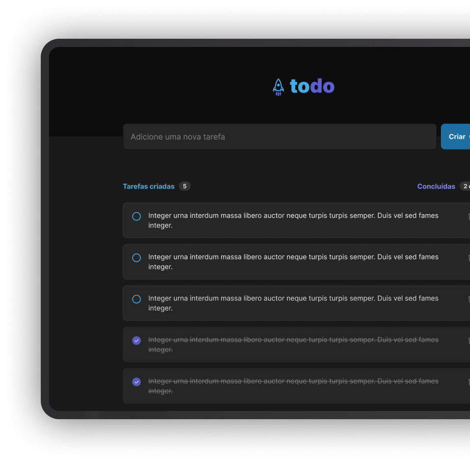

<h1 align="center">
  
</h1>

<h4 align="center">A To Do app made with Vite.js</h4>

<p align="center">
  
  
  
  <a href="https://www.linkedin.com/in/caiotracera/">
    
  </a>
  <br />
  <a href="https://github.com/caiotracera/todo-vite/commits/master">
    
  </a>
  <a href="https://github.com/caiotracera/todo-vite/issues">
    
  </a>
  
  
</p>

<blockquote align="center">
“There are no quick fixes. But, by taking action just a little bit every day, you will build up a powerful reservoir of confidence, self-esteem, and discipline.”
</blockquote>

<p align="center">
  <a href="#rocket-about-the-project">About the project</a>&nbsp;&nbsp;&nbsp;|&nbsp;&nbsp;&nbsp;
  <a href="#man_technologist-technologies">Technologies</a>&nbsp;&nbsp;&nbsp;|&nbsp;&nbsp;&nbsp;
  <a href="#wrench-getting-started">Getting started</a>&nbsp;&nbsp;&nbsp;|&nbsp;&nbsp;&nbsp;
  <a href="#memo-license">License</a>&nbsp;&nbsp;&nbsp;
</p>

<div align="center">
  
</div>

# :rocket: About the project

<b>todo-vite</b> is a fake todo app made with Vite.js. The main goal of this project is to learn more about Vite.js and its ecosystem.

# :man_technologist: Technologies

* Vite.js
* React.js
* Typescript
* SWC

# :wrench: Getting started

To run this project locally, you must have installed <a href="https://nodejs.org/en/" target="_blank">Node.js</a>
and <a href="https://git-scm.com/" target="_blank">Git SCM</a>. In addition, you must be able to run the Android or iOS emulator in your machine.

<b>Clone the project</b>

```shell
$ git clone https://github.com/caiotracera/todo-vite
$ cd todo-vite
```
<b>Install dependencies</b> (Check the Node version at `.nvmrc`)

```shell
$ nvm use
$ npm install
```

<b>Start the project</b>

```shell
$ npm run dev
```

# :memo: License

Made with :sparkling_heart: by Caio.
<br />
:coffee: Can we have a coffe? <a href="https://www.linkedin.com/in/caiotracera/">Get in touch!</a>
